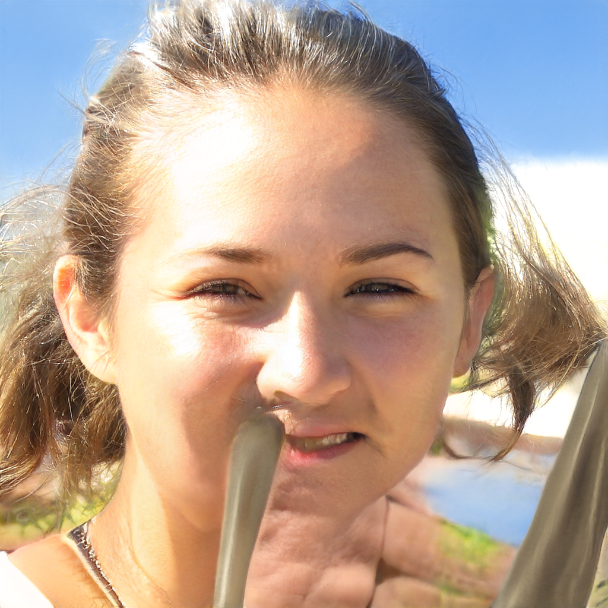
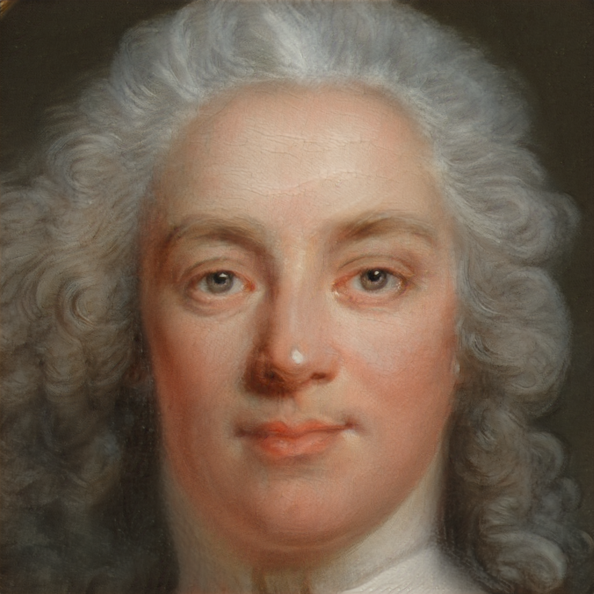
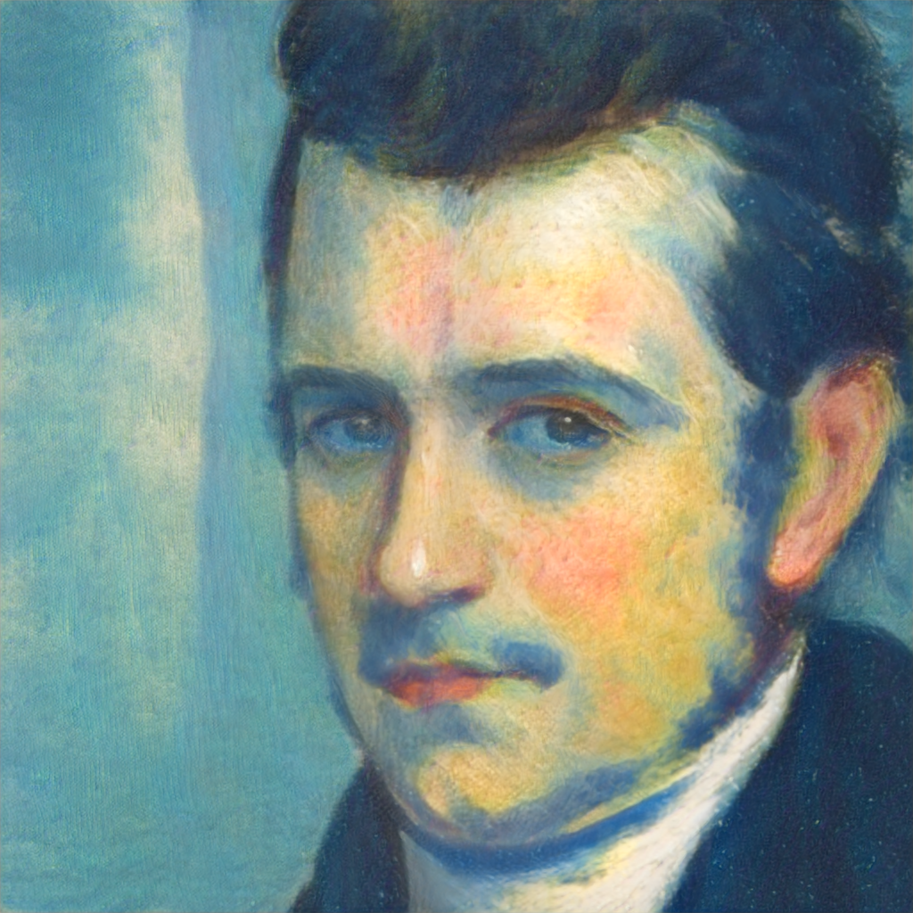
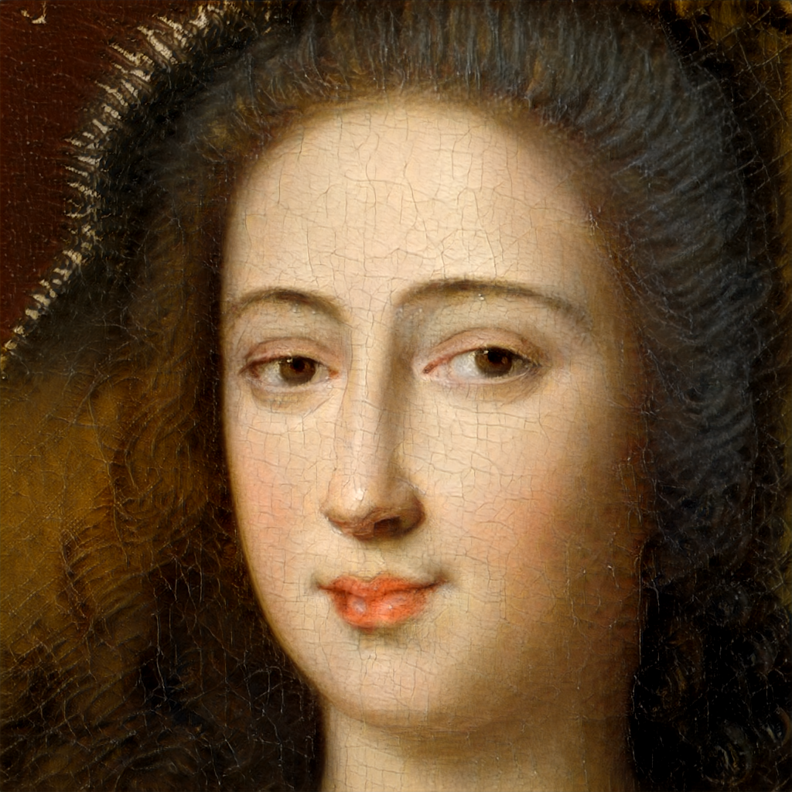

# Latent-Space-Faces
This repository is intended for learning how to use and manipulate StyleGAN pre-trained models.

## Usage
### Install
Clone the repository.
```shell
git clone https://github.com/SlyZ1/Latent-Space-Faces.git
cd Latent-Space-Faces
```

Initialize the submodule (StyleGAN2).
```shell
git submodule update --init --recursive
```

### Setup
Create a virtual environment with your favorite Python version (tested with Python 3.14.4).
```shell
python3 -m venv venv
```

Activate the virtual environment.
- On Linux/macOS
```shell
source venv/bin/activate
```
- On Windows
```shell
venv\Scripts\Activate.ps1
```

Install all the dependencies.
```shell
pip install -r requirements.txt
```

Download a pretrained model amongst (will be saved as `./models/<MODEL NAME>.pkl`):
- ffhq
- metfaces
- afhqcat
- afhqdog
- afhqwild
- cifar10
- brecahad
```shell
./download-model.sh <MODEL NAME>
```


### Run
Run the StyleGAN2 test sampling.
```shell
python3 stylegan2/generate.py --outdir=out --trunc=1 --seeds=85,265,297,849 --network=./models/<MODEL NAME>.pkl
```

Expected results for `FFHQ`:
|`out/seed0085.png`|`out/seed0265.png`|`out/seed0297.png`|`out/seed0849.png`|
|-|-|-|-|
|||||

Expected results for `MetFaces`:
|`out/seed0085.png`|`out/seed0265.png`|`out/seed0297.png`|`out/seed0849.png`|
|-|-|-|-|
|||||
