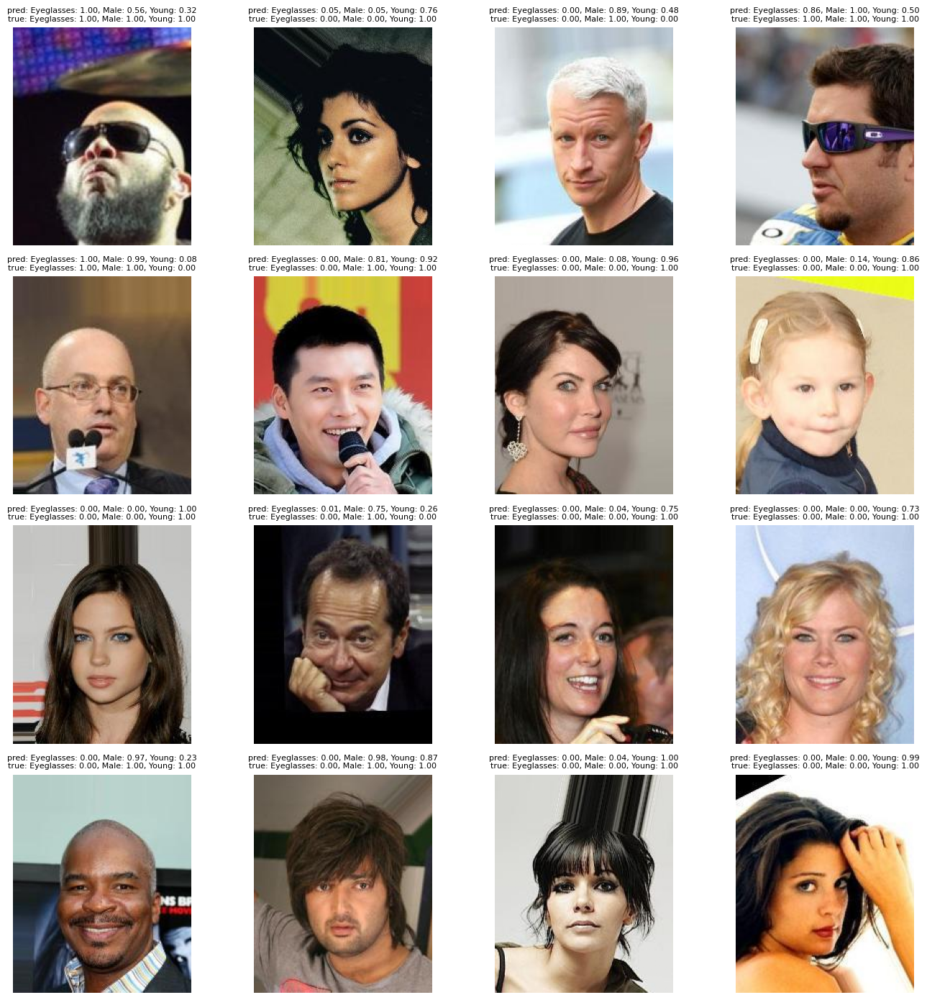

# Latent Space Faces

> [!NOTE]
> This repository is intended for learning how to use and manipulate StyleGAN pre-trained models.

## Usage
### Install
Clone the repository.
```shell
git clone https://github.com/SlyZ1/Latent-Space-Faces.git
cd Latent-Space-Faces
```

Initialize the submodule (StyleGAN2).
```shell
git submodule update --init --recursive
```

### Setup
Create a virtual environment with your favorite Python version (tested with Python 3.11.15).
> NOTE: newer versions of Python (3.13 or 3.14) might not work well with torchvision.
```shell
python3 -m venv venv
```

Activate the virtual environment.
- On Linux/macOS
```shell
source venv/bin/activate
```
- On Windows
```shell
venv\Scripts\Activate.ps1
```

Install all the dependencies.
```shell
pip install -r requirements.txt
```

Download a pretrained model (saved as `./models/<MODEL NAME>.pkl`):
- ffhq
- metfaces
- afhqcat
- afhqdog
- afhqwild
- cifar10
- brecahad
```shell
./download-model.sh <MODEL NAME>
```


### Run
Run the StyleGAN2 test sampling.
```shell
python stylegan2/generate.py --outdir=out --trunc=1 --seeds=85,265,297,849 --network=./models/<MODEL NAME>.pkl
```

Expected results for `FFHQ`:
|`out/seed0085.png`|`out/seed0265.png`|`out/seed0297.png`|`out/seed0849.png`|
|-|-|-|-|
|||||

Expected results for `MetFaces`:
|`out/seed0085.png`|`out/seed0265.png`|`out/seed0297.png`|`out/seed0849.png`|
|-|-|-|-|
|||||

## Classifier


### Architecture And Dataset
The classifier is based on a ResNet-18 backbone pretrained on ImageNet-1K. The backbone is frozen and a linear classification head is trained on CelebA binary attributes.

The current classifier predicts three attributes, in this order:
- `Eyeglasses`
- `Male`
- `Young`

The CelebA dataset is expected at `dataset/celeba/` with:
- `img_align_celeba/`
- `attributes.txt`
- `landmarks.txt`

### Usage
Train the classifier with:
```shell
python classifier.py
```

The latest checkpoint is saved to:
```text
models/classifier.pt
```

`classifier.py` can also be imported as a library:
```python
from classifier import Classifier
```

See `classifier_test.ipynb` for a classifier usage example.
